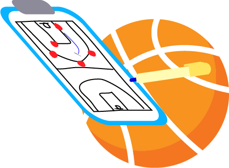
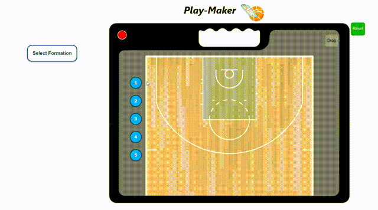
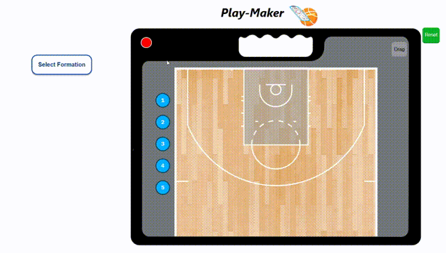
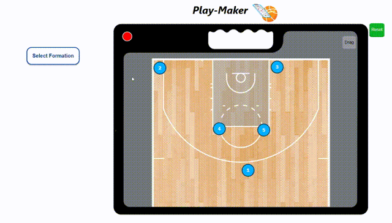

# ___Play-Maker___

#### A Basketball Gameplan Creator
---
__What is this web app about?__

>We are building a basketball gameplan creator web application using React, where the user can make formations, plays and tactics.

__Current features:__

>Currently, the user can make formations and save them with custom names for future use.

__Further features down the road:__

>Login system and accounts to save creations
>
>Ability to create and save dynamic plays and tactics
>
>Addition of defense
>
>Artificial intelligence integration for defenses